# Event-Driven Incident Observability Platform

**Java 25 · Spring Boot · Kafka · PostgreSQL · Prometheus · Loki · Tempo · Grafana**

A local incident-investigation platform that turns a monitoring alert into a durable,
queryable report containing recent metrics, error logs and trace summaries.

[Run locally](#run-locally) · [Verify the complete flow](#verify-the-complete-flow) ·
[Failure demos and timings](docs/failure-demos.md) · [Testing guide](docs/testing.md) · [Operations and retention](docs/operations.md)

## Problem solved

During an incident, engineers normally move between alerts, dashboards, logs and
traces. An alert can also be duplicated, or lost between database persistence and
message publication.

This project provides one workflow that:

- accepts firing and resolved Alertmanager webhooks;
- persists the incident before asynchronous processing begins;
- publishes work reliably through a transactional outbox;
- deduplicates repeated alerts using the Alertmanager fingerprint;
- collects a five-minute evidence window from Prometheus, Loki and Tempo;
- stores a bounded incident report in PostgreSQL for API and Grafana access.

## Architecture

Read from **top to bottom**: generate traffic, detect a failure, preserve the work,
collect evidence, and inspect the result.

### 1. Workload and failure detection



Gateway and Order also emit logs and traces; those duplicate edges are omitted for
readability. The gateway routes client traffic; Alertmanager calls the Incident API
directly. Loki and Tempo provide evidence, while Prometheus evaluates alert rules.

### 2. Durable investigation and reporting



**Color key:** blue = workload · green = telemetry · purple = incident processing ·
rose = persistent storage · amber = events / notifications · cyan = user interfaces.

The API, outbox publisher and investigation worker run inside **one incident-service
container**. Kafka decouples their work; PostgreSQL preserves incident state and
pending events. A resolved webhook closes the incident through the same intake
path. The platform records and investigates failures; it does not repair services.

## End-to-end flow

1. Prometheus evaluates service metrics and sends a firing alert to Alertmanager.
2. Alertmanager calls `POST /api/incidents/webhooks/alertmanager`.
3. The incident service saves the incident and an `incident-investigation` outbox
   event in the same PostgreSQL transaction.
4. The outbox publisher retries until Kafka acknowledges the event.
5. The Kafka worker queries the previous five minutes of metrics, logs and traces.
6. The worker stores the report and queues an `incident-notification` event.
7. A resolved webhook closes the same incident; late worker results cannot reopen it.
8. The API and Grafana expose incident history. Email delivery is optional and off
   by default.

## System-design decisions

| Concern | Implementation |
| --- | --- |
| Database/Kafka dual-write failure | Transactional outbox; unpublished events are retried |
| Duplicate alerts | Active incidents are keyed by fingerprint and protected by a partial unique index |
| Slow evidence collection | Kafka separates webhook intake from investigation work |
| Kafka redelivery | Consumers and state transitions tolerate repeated processing; delivery remains at least once |
| Missing telemetry source | The report records partial collection failures instead of discarding the investigation |
| Recovery race | A resolved incident remains closed when an investigation result arrives late |
| Unbounded data growth | Paginated history, bounded evidence and scheduled incident/outbox cleanup |
| Local resource usage | One Compose file, memory caps, short telemetry retention and optional email/Kafka UI profiles |

## Repository layout

| Path | Purpose |
| --- | --- |
| `incident-service` | Webhook intake, incident history, outbox publisher and evidence worker |
| `notification-service` | Optional Kafka email consumer with an enable/disable switch |
| `api-gateway` | Gateway routes and circuit breakers |
| `order-service`, `inventory-service` | Instrumented workloads used to demonstrate failures |
| `ops` | PostgreSQL initialization and Prometheus/Grafana/Alertmanager/Tempo configuration |
| `scripts/smoke-test.ps1` | End-to-end deduplication, investigation and resolution check |
| `docker-compose.yml` | Complete lightweight local environment |

## Run locally

### Requirements

- Git
- Docker Desktop with Docker Compose
- At least 4 GB of memory available to Docker

Java, Maven, Kafka and PostgreSQL do not need to be installed locally.

### 1. Clone and configure

```powershell
git clone https://github.com/Abhay123abhi/event-driven-incident-observability.git
cd event-driven-incident-observability
Copy-Item .env.example .env
```

On Linux/macOS, replace the last command with `cp .env.example .env`.
Set `POSTGRES_PASSWORD` and `GRAFANA_ADMIN_PASSWORD` in `.env`. Email remains off.

### 2. Start the stack

```powershell
docker compose config --quiet
docker compose up --build -d --remove-orphans
docker compose ps
```

The first build downloads the base images and Maven dependencies. Wait until the
four default Java services show `healthy`.

### 3. Open the services

| Service | URL / connection |
| --- | --- |
| Incident history | http://localhost:8084/api/incidents?scope=all |
| Grafana | http://localhost:3000 (`admin` / password from `.env`) |
| Incident Desk UI + Gateway | http://localhost:9000 |
| Prometheus alerts | http://localhost:9090/alerts |
| Alertmanager | http://localhost:9093 |
| PostgreSQL | `localhost:5432`, database `incident_platform`, user `observe` |

All published ports bind to `127.0.0.1` by default.
If port `5432` is already used by a local PostgreSQL installation, set an unused
`POSTGRES_PORT` (for example `5433`) in `.env` before starting the stack.

## Incident Desk

Open **http://localhost:9000** for incident history, status filters, page search,
and report details. Metrics, error samples, trace summaries and collection warnings
are separated for readability. The lifecycle shows recorded detection, update and
resolution timestamps; it does not invent worker-stage history.
Grafana stays available for dashboards and detailed telemetry exploration.
The UI is served by the gateway with plain HTML/CSS/JavaScript; no extra frontend
container, Node installation or browser-to-database access is needed.

**Email settings** opens the live on/off control. First configure SMTP_HOST,
SMTP_PORT, SMTP_USERNAME, SMTP_PASSWORD, NOTIFICATION_FROM and ALERT_EMAIL_TO
in .env, then start the optional consumer:

```powershell
docker compose --profile email up --build -d notification-service
```

The switch takes effect for subsequent events without restarting. Off consumes
events without sending; in-flight mail may finish. On restart it returns to
EMAIL_NOTIFICATIONS_ENABLED from .env (false by default). Missing SMTP settings
disable enabling; complete settings do not guarantee delivery. The UI never exposes
credentials. These local admin endpoints are unauthenticated: retain localhost
bindings; add authentication before hosting the gateway publicly.

## Failure scenarios

| Test | Alert / expected evidence | Timing |
| --- | --- | --- |
| Inventory latency | HighResponseLatency | P95 >2s for 2m with traffic |
| Inventory HTTP errors | HighErrorRate | >5% 5xx for 2m with traffic |
| Gateway → Order → Inventory failure | Per-service errors and available traces | Depends on thresholds |
| Workload stopped | ServiceUnavailable | Scrape failure for 3m |
| Kafka stopped | Unpublished outbox events | Retries when broker returns |
| Loki / Tempo stopped | Explicit collection warning | During next investigation |
| Duplicate webhook | Same incident ID | On intake |
| DB pool saturation | DatabaseConnectionPoolSaturation | >90% active connections for 2m; advanced test |

Allow an additional 15s scrape/evaluation cadence, 30s new alert-group wait, and
up to 5m group-update delay. Recovery can lag while the 5m metric window clears.
These are configured thresholds, not measured end-to-end guarantees.
**[Copy-paste tests and recovery steps →](docs/failure-demos.md)**

## Verify the complete flow

Run the deterministic smoke test from PowerShell:

```powershell
.\scripts\smoke-test.ps1
```

Expected result:

```text
PASS: <incident-id> was investigated, deduplicated, and resolved.
```

The test verifies webhook intake, fingerprint deduplication, PostgreSQL persistence,
outbox publication, Kafka processing, evidence-report persistence and resolution.

Inspect the result directly:

```powershell
Invoke-RestMethod 'http://localhost:8084/api/incidents?scope=all'
docker compose exec postgres psql -U observe -d incident_platform -c "SELECT id, fingerprint, status, detected_at, resolved_at FROM incidents ORDER BY detected_at DESC;"
docker compose exec postgres psql -U observe -d incident_platform -c "SELECT aggregate_id, topic, created_at, published_at FROM outbox_events ORDER BY created_at DESC;"
```

To generate real slow traffic and watch Prometheus → Alertmanager → incident creation,
follow [Demonstrate a real failure and recovery](docs/testing.md#demonstrate-a-real-failure-and-recovery).

## Optional tools

Kafka UI is started only when needed:

```powershell
docker compose --profile tools up -d kafka-ui
```

Open http://localhost:8086. Email is also optional; see the
[email testing guide](docs/testing.md#optional-email-and-testing-toggle).

## Stop or reset

```powershell
docker compose down
```

This keeps the named volumes. To intentionally delete all local databases, Kafka
data and telemetry history:

```powershell
docker compose down -v
```

## Scope

This is a single-node local demonstration of incident reliability patterns, not a
production monitoring replacement. It uses at-least-once delivery and one incident
worker; authentication, DLQ/replay, multi-instance claiming, backups and production
retention policies are documented as follow-up work in
[Operations and retention](docs/operations.md#limits-and-follow-up-work).
